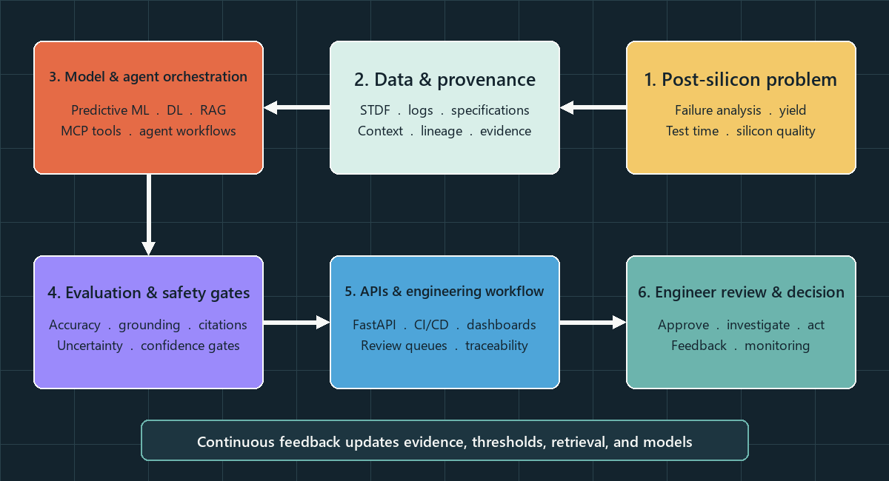

<!-- GitHub profile README -->

  

  
  
  
  
  

## About

I am a **Senior Staff Engineer and Post-Silicon Validation AI/ML Architect** with 16+ years in semiconductor test engineering, including 6+ years leading AI/ML, GenAI, and agentic-system delivery. I architect systems that connect silicon, test, text, and engineering data to predictive models, grounded knowledge, governed agents, and human-review decisions.

My work spans shared AI platforms, local MCP services, RAG and knowledge graphs, post-silicon predictive analytics, MLOps, and engineering enablement. I have led cross-functional AI/ML initiatives and structured learning programmes reaching 200+ engineers across seven countries.

This is an **evidence-first public portfolio**. The repositories below are independent reconstructions using synthetic or CC0 data. Their benchmark evidence is separate from professional outcomes; confidential code, data, identifiers, and integration details are not published.

## Seven selected systems

These are the seven public projects with achievement stories in the v7 resume. Metrics below are tied to repository evidence; all evaluation data is synthetic or CC0.

| # | Selected system | Discipline | Verified public evidence |
|---:|---|---|---|
| **1** | [**AARCAR: Evidence-Grounded Multi-Agent RCA**](https://github.com/rajendarmuddasani/AARCAR-Multi-Agent-RCA-Platform) | **Agentic AI** | Neo4j + ChromaDB + LangGraph; **94.24% task success** across **2,100** sealed synthetic cases, **95.48% citation precision**. |
| **2** | [**Evidence-Backed Multi-Agent Test Failure RCA**](https://github.com/rajendarmuddasani/LangGraph-Multi-Agent-Test-Failure-RCA-Platform) | **Agentic AI** | Six-stage LangGraph + BM25 workflow; **72% automatic coverage at 100% accepted accuracy** on **25** sealed synthetic STDF cases, with the remainder routed to review. |
| **3** | [**Graph-Backed MCP Java Test Generation**](https://github.com/rajendarmuddasani/GraphDB_GenAI_MCP_Test_Program_Development) | **Generative AI** | Five Neo4j-backed MCP tools; **32/32** bounded tasks passed and **8/8** unsafe intents rejected using a CC0 Java fixture. No external LLM calls. |
| **4** | [**ResNet Wafer Pattern Classifier**](https://github.com/rajendarmuddasani/Transfer_Learning_ResNet_STDF_Wafer_Map_Yield_Predictor) | **Deep Learning** | Calibrated ResNet-18; **93.63% accuracy**, **0.9361 macro F1**, and **0.9273 MCC** on **800** confirmation images from unseen synthetic wafer families. |
| **5** | [**Chip-Level Test Time Optimizer**](https://github.com/rajendarmuddasani/Chip_Level_Test_Time_Optimizer) | **Machine Learning** | Classifier + VAE + statistical guardrails; **13.524% simulated optional-stage reduction** at **99.0% defect recall** on **10,000** post-freeze confirmation chips. |
| **6** | [**NLP Root Cause Predictor**](https://github.com/rajendarmuddasani/NLP_Root_Cause_Predictor) | **Machine Learning** | Calibrated word/character SVM; **88.75% accepted accuracy at 73.17% coverage** and **97.50% OOD-safe handling** across synthetic failure reports. |
| **7** | [**Post-Silicon Test Bin Detection MLOps**](https://github.com/rajendarmuddasani/post-silicon-bin-detection-mlops) | **Machine Learning** | XGBoost six-bin classifier; **83.03% accuracy** and **0.5352 macro F1** on a reused **3,000-die synthetic benchmark partition**. A fresh grouped confirmation remains open. |

## Engineering focus

- **Agentic AI and LLM engineering:** LangGraph, LangChain, MCP, RAG, knowledge graphs, grounded retrieval, workflow evaluation, and human-review routing.
- **ML and predictive analytics:** XGBoost, scikit-learn, PyTorch, ResNet, NLP, anomaly detection, defect classification, yield prediction, and test-time optimisation.
- **MLOps and data engineering:** MLflow, FastAPI, Docker, CI/CD, Kafka, PySpark, Delta Lake, Airflow, AWS SageMaker, STDF parsing, and Oracle SQL.
- **Post-silicon validation:** wafer sort, final test, silicon bring-up, ATE automation, statistical validation, wafer analytics, and test-program development.

## Architecture method

  

- **Evidence:** deterministic evaluation, immutable artifacts, data/model hashes, uncertainty, and measured-versus-target language.
- **Quality:** leakage controls, class-level errors, calibration, shift sensitivity, and rejected experiments.
- **Safety:** confidence routing, bounded-risk policies, human review, drift gates, canary promotion, and rollback.
- **Delivery:** APIs, containers, CI/CD, event/data platforms, retrieval, knowledge graphs, and governed workflows.

## Technology

             

## Contact

**LinkedIn:** [linkedin.com/in/rajendar-muddasani-8a177620](https://www.linkedin.com/in/rajendar-muddasani-8a177620)

**Email:** [rajendar.mi46@gmail.com](mailto:rajendar.mi46@gmail.com)