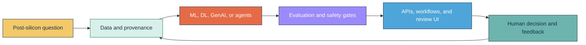

<!-- GitHub profile README -->

  

  
  
  
  
  

  
  
  
  

## About

I am a **Senior Staff Engineer and AI/ML Architect** with 16+ years in semiconductor test engineering. I design systems that connect silicon, test, text, and engineering data to predictive models, grounded knowledge, governed agents, and human-review decisions.

This is an **evidence-first portfolio**. Public repositories use independently generated synthetic or licensed public data, bind displayed numbers to reproducible artifacts, and show limitations beside results. Confidential company code, data, identifiers, and integration details are not published.

## Evidence portfolio

The projects are ordered by the portfolio audit sequence. The **Numbers** column contains accepted evidence only; targets and architecture-only states are labelled explicitly.

| # | System | Lane | Numbers | Delivery and evidence boundary |
|---:|---|---|---|---|
| **01** | [**Post-Silicon Bin Detection MLOps**](https://github.com/rajendarmuddasani/post-silicon-bin-detection-mlops)  |  | **15,000** synthetic dies, **25** features, **6** bins Accuracy **0.8303**, macro F1 **0.5352**, ECE **0.0179** | XGBoost v4, FastAPI, Streamlit, model/schema hashing, Docker. The 20-30% test-time reduction remains a target; the strict measured policy is **0.00%**. |
| **02** | [**NLP Root Cause Predictor**](https://github.com/rajendarmuddasani/NLP_Root_Cause_Predictor)  |  | **20,000** independent synthetic reports, **10** classes Accepted accuracy **88.75%** at **73.17%** coverage; OOD safe handling **97.50%** | Calibrated word/character SVM, abstention, OOD routing, feedback, drift gates, API, and containers. Real-domain approval remains pending. |
| **03** | [**RL Test Flow Optimization**](https://github.com/rajendarmuddasani/rl-test-flow-optimization)  |  | **15,000** simulated confirmation episodes Defect recall **96.46%**, escapes **3.54%**, time headroom **51.30%** | Bayesian risk policy, bounded API, evidence dashboard, Docker. Experimental MaskablePPO was rejected at **82.72%** mean recall; time is simulated, not production ATE savings. |
| **04** | [**ResNet Wafer Pattern Classifier**](https://github.com/rajendarmuddasani/Transfer_Learning_ResNet_STDF_Wafer_Map_Yield_Predictor)  |  | **1,920 / 480 / 800** train/validation/confirmation images Accuracy **93.63%**, macro F1 **0.9361**, MCC **0.9273**, minimum recall **83.0%** | Group-isolated synthetic families, ResNet-18, calibrated ONNX, FastAPI, React, Streamlit, non-root Docker. No WM-811K, STDF, yield, or production-silicon claim. |
| **05** | [**Chip-Level Test Time Optimizer**](https://github.com/rajendarmuddasani/Chip_Level_Test_Time_Optimizer) |  | **No accepted end-to-end benchmark yet** 15% reduction and zero escapees remain targets | Neural classifier, VAE anomaly detection, sigma rules, and conservative OR gate have architecture/component evidence. Constrained simulation is the next gate. |
| **06** | **Post-Silicon Validation RAG** |  | **Benchmark queued** | Private multi-format ingestion, ChromaDB, local/cloud LLM modes, and citations. Retrieval, groundedness, citation, safety, latency, and cost evidence are still required. |
| **07** | [**AARCAR Multi-Agent RCA Platform**](https://github.com/rajendarmuddasani/AARCAR-Multi-Agent-RCA-Platform) |  | **Architecture and orchestration evidence** No accepted RCA quality benchmark yet | Three-agent LangGraph RCA with graph analysis and semantic retrieval. Service fallbacks are disclosed; grounded RCA evaluation is the next gate. |
| **08** | [**LangGraph Multi-Agent Test Failure RCA**](https://github.com/rajendarmuddasani/LangGraph-Multi-Agent-Test-Failure-RCA-Platform) |  | **Architecture and demo evidence** No accepted end-to-end benchmark yet | Six-agent statistical, spatial, correlation, hypothesis, and report workflow. Real retrieval, persistence, and expert-labelled evaluation remain open. |
| **09** | [**Enterprise ML Data Pipeline**](https://github.com/rajendarmuddasani/Enterprise_ML_Data_Pipeline) |  | **Latency artifact only** 1,000 STDF files/day remains a target | Kafka, PySpark, Delta Lake, MLflow, Airflow, and FastAPI architecture. Safe parsing, controlled throughput, resource, lineage, and recovery evidence are required. |
| **10** | [**GraphDB GenAI MCP Test Program Development**](https://github.com/rajendarmuddasani/GraphDB_GenAI_MCP_Test_Program_Development) |  | **Tested starter** End-to-end generation quality not yet measured | Neo4j discovery and project preflight exist. Executable MCP generation, validation fixtures, security controls, and task-quality metrics remain open. |
| **11** | **DRAM Yield Predictor MLOps** |  | **Large synthetic simulation; audit pending** | Private rare-defect Transformer-CNN with drift, canary, retraining, and rollback simulation. Metric and artifact validation plus resume-inclusion decision are required. |
| **12** | **Domain-Specific LLM Fine-Tuning Platform** |  | **Architecture evidence; benchmark pending** | Private LoRA/QLoRA, retrieval, evaluation APIs, and governed serving design. Public data/model selection and executed quality/safety/cost evidence remain open. |
| **13** | **ResNet U-Net Wafer Map Defect Segmenter** |  | **No implementation or benchmark** | Private empty repository reserved for a distinct pixel-level segmentation project. Build-versus-archive decision is required before presentation. |

## Architecture method

- **Evidence:** deterministic evaluation, immutable artifacts, data/model hashes, uncertainty, and measured-versus-target language.
- **Model quality:** leakage controls, class-level errors, imbalance-aware metrics, calibration, shift sensitivity, and rejected experiments.
- **Operational safety:** confidence routing, bounded-risk policies, human review, drift gates, canary promotion, and rollback design.
- **Platform architecture:** APIs, containers, CI/CD, event/data platforms, retrieval, knowledge graphs, and governed agent workflows.

## Technology

## Contact

- [LinkedIn](https://www.linkedin.com/in/rajendar-muddasani-8a177620)
- [Email](mailto:rajendar.mi46@gmail.com)