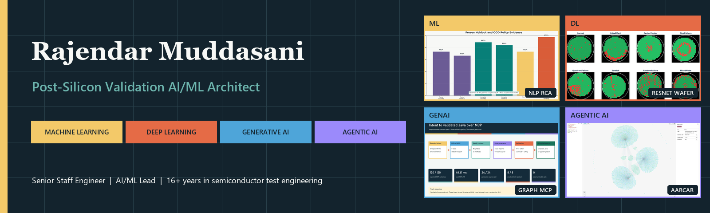
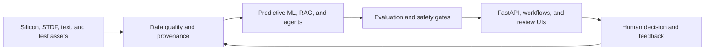

<!-- GitHub profile README -->

  

  
  
  
  

## About

I am a Senior Staff Engineer and AI/ML lead working at the intersection of semiconductor test engineering, predictive ML, GenAI, and governed agentic systems. I design workflows that connect silicon and test data to reproducible models, engineering decisions, and human-review gates.

This profile is an **evidence-first portfolio**. Public repositories use synthetic or licensed public data, distinguish measured results from targets, and expose limitations alongside architecture. Confidential company code, data, identifiers, and integration details are not published.

## Featured evidence

### [Post-Silicon Bin Detection MLOps](https://github.com/rajendarmuddasani/post-silicon-bin-detection-mlops)

A reproducible six-class XGBoost system over 25 synthetic die-level parameters, with model and schema hashing, FastAPI inference, a Streamlit evidence dashboard, calibration analysis, per-class failure analysis, and safety-aware early-exit evaluation.

| Evidence | Reproduced result |
|---|---:|
| Reused 3,000-row benchmark accuracy | 0.8303 |
| Weighted F1 | 0.8140 |
| Macro F1 | 0.5352 |
| Balanced accuracy | 0.4945 |
| Top-label expected calibration error | 0.0179 |

The public data is synthetic and the v4 benchmark reuses the historical holdout. The stated 20-30% test-time reduction is an unmet target; the current strict safety policy measured 0.00% reduction. A new grouped and time-based confirmation set is the promotion gate.

### [NLP Root Cause Predictor](https://github.com/rajendarmuddasani/NLP_Root_Cause_Predictor)

A ten-class short multilingual failure-text triage system with a 20:1 long tail, validation-only model/policy selection, hash-verified serving, abstention, OOD handling, reviewer feedback, metrics, drift gates, and non-root containers.

| Evidence | Reproduced result |
|---|---:|
| Forced future/group holdout accuracy | 73.17% |
| Forced macro F1 | 0.6650 |
| Policy coverage | 73.17% |
| Accepted accuracy / macro F1 | 88.75% / 0.8385 |
| OOD safe handling | 97.50% |

The 20,000-report corpus is independently generated synthetic text with five-word median length, English/German/mixed/code styles, duplicates, annotation conflicts, and zero incident/template overlap. The implementation is deployment-ready; real-domain model approval and measured reviewer outcomes remain future gates.

## Portfolio

The order below is the reproducibility-audit sequence, from the smallest evidence gap to the largest. Private entries are listed without inaccessible links.

| # | System | Engineering focus | Access and evidence state |
|---:|---|---|---|
| 1 | [Post-Silicon Bin Detection MLOps](https://github.com/rajendarmuddasani/post-silicon-bin-detection-mlops) | Six-bin XGBoost, FastAPI, Streamlit, model lineage, safety policy | **Public**; locally reproduced evidence |
| 2 | [NLP Root Cause Predictor](https://github.com/rajendarmuddasani/NLP_Root_Cause_Predictor) | Ten-class short multilingual triage, selective policy, production reference | **Public**; locally reproduced synthetic evidence; real-domain approval pending |
| 3 | **RL Test Flow Optimization** | Gymnasium test environment, DQN policy, cost-aware selection | **Private**; measured synthetic simulation |
| 4 | [ResNet STDF Wafer Map Defect Classifier](https://github.com/rajendarmuddasani/Transfer_Learning_ResNet_STDF_Wafer_Map_Yield_Predictor) | STDF pipeline, ResNet-18, eight-pattern classification, API and React | **Public**; reported metric under reproduction |
| 5 | [Chip-Level Test Time Optimizer](https://github.com/rajendarmuddasani/Chip_Level_Test_Time_Optimizer) | Neural classifier, VAE anomaly detection, sigma rules, conservative OR gate | **Public**; architecture and component-test evidence |
| 6 | **Post-Silicon Validation RAG** | Multi-format ingestion, ChromaDB, local/cloud LLM modes, citations | **Private**; retrieval benchmark queued |
| 7 | [AARCAR Multi-Agent RCA Platform](https://github.com/rajendarmuddasani/AARCAR-Multi-Agent-RCA-Platform) | Three-agent LangGraph RCA, graph analysis, semantic retrieval | **Public**; orchestration evidence; service fallbacks disclosed |
| 8 | [LangGraph Multi-Agent Test Failure RCA](https://github.com/rajendarmuddasani/LangGraph-Multi-Agent-Test-Failure-RCA-Platform) | Six-agent statistical, spatial, correlation, hypothesis, and report flow | **Public**; architecture and demo evidence |
| 9 | [Enterprise ML Data Pipeline](https://github.com/rajendarmuddasani/Enterprise_ML_Data_Pipeline) | Kafka, PySpark, Delta Lake, MLflow, Airflow, FastAPI | **Public**; architecture and latency artifact; scale remains a target |
| 10 | [GraphDB GenAI MCP Test Program Development](https://github.com/rajendarmuddasani/GraphDB_GenAI_MCP_Test_Program_Development) | Neo4j discovery, project preflight, MCP-oriented generation pattern | **Public**; tested starter; end-to-end generation pending |
| 11 | **DRAM Yield Predictor MLOps** | Rare-defect Transformer-CNN, drift, canary, retraining, rollback simulation | **Private**; large synthetic simulation |
| 12 | **Domain-Specific LLM Fine-Tuning Platform** | LoRA/QLoRA, retrieval, evaluation APIs, governed serving | **Private**; architecture evidence; benchmark pending |
| 13 | **ResNet U-Net Wafer Map Defect Segmenter** | Reserved pixel-level wafer-defect segmentation concept | **Private and empty**; not presented as completed work |

## System view

## Engineering lens

- **Evidence:** deterministic evaluation, immutable artifacts, data and model hashes, uncertainty, and explicit measured-versus-target language.
- **Model quality:** class-level precision, recall, F1, calibration, imbalance-aware baselines, leakage controls, and shift sensitivity.
- **Operational safety:** confidence routing, bounded-risk policies, human review, drift detection, retraining criteria, canary promotion, and rollback design.
- **Platform architecture:** FastAPI, Docker, CI/CD, MLflow, Kafka, Spark, Delta Lake, Airflow, RAG, knowledge graphs, and MCP services.
- **Semiconductor domain:** wafer sort and final test, STDF analytics, ATE workflows, yield, defect classification, and test-time optimization.

## Technology

## Contact

- [LinkedIn](https://www.linkedin.com/in/rajendar-muddasani-8a177620)
- [Email](mailto:rajendar.mi46@gmail.com)
